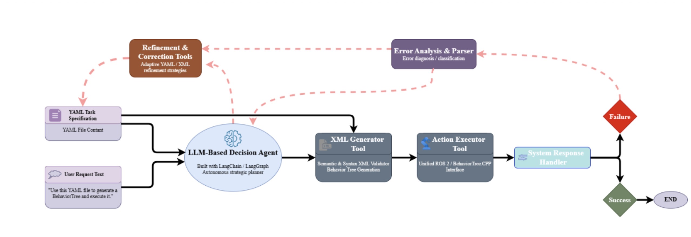

# LLM-Based Adaptive Behavior Tree Generation for Robot Manipulation

> [!WARNING]
> This repository is under heavy development. Some features may be broken or missing. If you encounter issues, please contact the developers. 


---

## 🎯 Project Overview

This package implements an **LLM-powered agent** that automatically generates, validates, and executes Behavior Trees for 6-DOF robot manipulation tasks. The system uses **natural language interaction** to convert high-level task descriptions into executable robot programs, with intelligent error recovery capabilities.

### Key Innovation
Traditional robot programming requires manual specification of motion primitives and error handling. This system enables:
- **Natural language to robot actions**: "Pick box and place at cell position"
- **Automatic BT generation**: YAML → BehaviorTree.CPP v4 XML
- **Intelligent error recovery**: Collision/IK failures → Automatic parameter adjustment
- **Iterative refinement**: Failed executions improve through LLM-guided modifications

---

## 🏗️ System Architecture



The pipeline consists of three main components:

### 1. **LangGraph Agent** (Orchestration Layer)
- Interprets natural language commands
- Coordinates tool execution
- Manages error recovery loops
- Built on LangChain/LangGraph framework

### 2. **LangChain Tools** (Execution Layer)
- **`xml_generator`**: Converts YAML configurations to BehaviorTree.CPP XML
- **`xml_validator`**: Validates BT structure and syntax (optional - generator validates)
- **`call_transfer_object`**: Executes BT via ROS2 action server

### 3. **Robot Execution** (Hardware Layer)
- BehaviorTree.CPP executor running on ROS2
- 6-DOF manipulator with gripper
- Real-time execution feedback

---

## Current Features

### ✅ Implemented
- **Automatic XML generation** from YAML with timestamp-based saving
- **File path auto-detection** (accepts both file paths and YAML content)
- **LangGraph-based agent** with tool calling and state management
- **ROS2 integration** via action server communication
- **Singleton ROS2 node pattern** (prevents memory leaks)
- **Dynamic path resolution** (works on any machine)
- **Comprehensive error reporting** from execution failures
- **Error classification system** (collision detection)
- **Intelligent error recovery**:
  - Parameter adjustment (goal_tolerances, approach_distance, allowed_touch_links)

### 🚧 In Development
- **Extended error classification** (IK failures, planning failures)
- **Advanced error recovery**:
  - Structural modifications (waypoint insertion, motion type switching)
- **Enhanced YAML structure** with node-specific overrides
- **Memory/learning system** to remember successful fixes

---


## 🚀 Quick Start

### Prerequisites
```bash
# ROS2 Jazzy environment
source /opt/ros/jazzy/setup.bash

# Python dependencies
pip install langchain langchain_core langgraph pydantic ollama
```

### Usage

**1. Start ROS2 BT Executor** (Terminal 1)
```bash
ros2 run <your_package> bt_executor
```

**2. Run LangGraph Agent** (Terminal 2)
```bash
cd /path/to/bt_gen_pipeline
python3 langchain/agents/bt_gen_agent.py
```

**3. Interact with Agent**
```
Type an instruction or "quit".

> Generate BT from config/inputs/case_2.yaml
[Processing...]
✅ Generated XML saved to behavior_trees/PICK_AND_PLACE_2_20260202_204318.xml

> Execute the behavior tree
[Processing...]
✅ Execution completed in 15.2 seconds
```

---

## 🔧 Configuration

### YAML Format Example
```yaml
behavior_tree:
  name: PickAndPlaceTree
  approach_distance: 0.1

script:
  end_effector: gripper_tcp
  planning_group: manipulator

PickAndMove:
  object_id: part_1
  pick_frame_id: part_1/pick_position

MoveAndPlace:
  object_id: part_1
  place_frame_id: table/place_position

TaskFlow:
  - SpawnScene
  - Pick
  - Place
```

### Tool Architecture
All tools built with **langchain_core.tools.StructuredTool** and **Pydantic schemas** for:
- Type safety and validation
- Better LLM tool understanding
- Maintainable code structure

### LangGraph Flow
```
User Input → LLM Node → Router → Tools Node → LLM Node → Response
                ↑                                          |
                └──────────── (loop if tools needed) ──────┘
```

---


## 📧 Contact

**Author**: Oguzhan Bozoglu  
**Email**: oguzhan.bozoglu@b-robotized.com  
**Institution**: b-robotized GmbH

---

## 📄 License

Apache License 2.0
